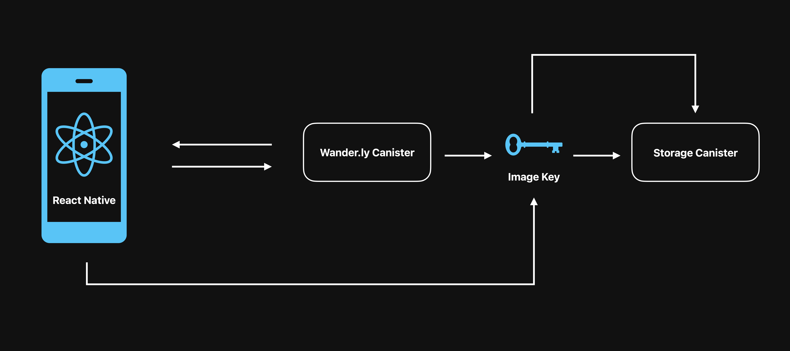

# 🌍 Wander.ly: Get Rewarded For Every Step You Take

Wander.ly is a revolutionary mobile app designed to address critical health, business, and environmental challenges in the Philippines 🇵🇭. By merging mobile health tech with blockchain technology (ICP), Wander.ly creates a motivational ecosystem that encourages physical activity, supports local businesses, and promotes eco-friendly transportation in the local community. Users are rewarded for meeting walking goals, participating in local business airdrops, and reducing their carbon footprint.

[Check out the landing page!](https://mc6mb-riaaa-aaaan-qmafa-cai.icp0.io/)

## 📖 Introduction

Wander.ly aims to combat the rising sedentary lifestyle in the Philippines by incentivizing physical activity through a rewarding system that also supports local economies and encourages eco-friendly behaviors. This app is for anyone looking to improve their health, support local businesses, and make a positive environmental impact.

### ✨ Highlighted Features:

- **AI-Generated Walking Goals:** Personalized morning, afternoon, and evening walking targets help users stay active throughout the day.
- **Community Sharing through Swipe Cards:** After completing tasks or participating in airdrops, users can share and interact with posts in a Tinder-style community feed.
- **Local Business Airdrops:** Supports small businesses by driving physical traffic through rewarding walking tasks that unlock special offers.
- **Environmental Impact Tracking:** Tracks and displays the positive environmental impact of users’ walking activities, like carbon emission savings and trees preserved.
- **Exploration and Leveling Up:** Encourages exploration and personal growth by leveling up users as they discover new places and complete tasks.

## 🚀 How It Works

1. **Personalized Tasks:** Users select from AI-generated, personalized walking tasks on the Explore screen, tailored to fit their fitness goals and daily schedules.
2. **Rewards for Activity:** Completing tasks helps users level up and unlock new features, keeping them engaged and motivated.
3. **Community Interaction:** Users post their walking experiences to the community feed, where they can interact with other users' posts through likes, shares, and awards.
4. **Support Local Businesses:** Users participate in airdrop events at local businesses, where walking to a designated area and scanning a QR code yields rewards.
5. **Track Environmental Impact:** The app tracks the environmental savings from walking, raising awareness and fostering a mindset geared towards sustainability.

[Watch the demo video](https://youtu.be/tDQ_lggSqeU)

[View the presentation](https://drive.google.com/file/d/1IQG5nUyiykmj9l6aTj6e9kDB2kCj3Zoq/view?usp=drive_link)

## 📱 Architecture



**Image Storage:**
- Wander.ly canister stores images by keys.
- User gets images by keys.

<br>


## 😎 See It In Action

> Please wait for the gifs to load >.<

- 👤 Login with Internet Identity


- ✅ See all tasks


- 💯 Completing a task


- 🌐 Community feature


- 💼 Business Interaction


## 🛠️ Installation

### 📋 Prerequisites

- [DFX](https://internetcomputer.org/docs/current/developer-docs/getting-started/install/)
- [Mops for Motoko](https://mops.one/docs/install)
- [Expo](https://docs.expo.dev/get-started/installation/)
- [Yarn](https://classic.yarnpkg.com/lang/en/docs/install/#mac-stable)
- [Android Studio](https://developer.android.com/codelabs/basic-android-kotlin-compose-install-android-studio#0) (for Android) or [Xcode](https://apps.apple.com/us/app/xcode/id497799835?mt=12) (for iOS)
- [Mapbox API](https://rnmapbox.github.io/docs/install?install-module=expo&configure-module=expo) for map functionality to work
- [LocalTunnel](https://localtunnel.me) (or [telebit.cloud](https://telebit.cloud)) for sharing local development environment

### ➡️ Install

```
// Install required dependencies of the app
1. yarn install

// Go to the ii_integration canister and install its dependencies too
2. cd src/ii_integration
3. npm install
4. npm run build
4. cd ../..

// Dfx commands to run
5. dfx start --clean
6. dfx deploy
7. dfx generate
8. Open .env file and copy the canister ids to EXPO_PUBLIC_CANISTER_ID_WANDERLY, EXPO_PUBLIC_CANISTER_ID_INTERNET_IDENTITY, and EXPO_PUBLIC_CANISTER_ID_II_INTEGRATION to sync ids.

// Prebuild the app to generate android and ios directories
9. npx expo prebuild --clean
```

## ⚙️ Usage

1. Make sure dfx is running (`dfx start --clean`) and project is deployed (`dfx deploy`).
1. Connect your physical device or open a simulator through **Android Studio** or **Xcode**.
2. `npx expo run:ios` (or `run:android`)
      Add `--device` (to select device)
4. `npx expo start --clear`

> **Note:** If it only goes to the launcher screen and not to the actual app, scan the QR code from the terminal where your started Expo with your device (if it does not show up, press **C**).

5. Get started by pressing the **Login with Internet Identity button**.

***

<details>
<summary><b>Optional: Make Internet Identity work with Physical Devices Locally</b></summary><br>

> This mini-guide uses Localtunnel for easier setup, but I recommend using **Telebit** for long-term development of the app.

1. Make sure Localtunnel is installed.
2. `lt --port 4943` (copy link to `EXPO_PUBLIC_TUNNEL_URL1`)
- 4943 is based on the port specified on dfx.json
3. `lt --port 4943` again (copy link to `EXPO_PUBLIC_TUNNEL_URL2`)

- We need two tunnels of the localhost because internet identity and the integration won't work with the same url

4. If you decide to only use it with simulators, just remove the `EXPO_PUBLIC_TUNNEL_URL1` and `EXPO_PUBLIC_TUNNEL_URL2` in the .env file.

> **Note:** To run the app on physical iOS devices, open the **ios** folder in your project directory, then open **Wanderly.xcworkspace** with Xcode. Click on Wanderly on the side bar then go to the **Signing & Capabilities** Tab. Once in there, remove **Push Notifications** capability and then add your free team for signing. Afterwards, close Xcode and run app again with run:ios (use --device to select your physical device).

</details>

<details>
<summary><b>Bonus: Use the app offline with Expo Dev Client and EAS Update</b></summary><br>

1. Make sure both **expo-dev-client** and **expo-updates** is installed before you build the app.
2. Configure expo-updates on the project so that it ties to your Expo account.
3. `npx expo prebuild --clean`
4. `npx expo run:ios/android --device` (This will build the development build with eas update on your device)
5. After installing the dev build, login to your Expo account on the launcher screen of the app. (If it does not appear, shake or three-tap your screen)
6. Run `eas update` on the root directory of the project and insert update message.
7. The update will be be stored on the EAS servers. You can view it on the [Expo Dashboard](https://expo.dev/), and then selecting the project (e.g. Wanderly) -> Updates.
8. Open the app on your device and view the update on the Extensions tab of the launcher screen. Open it and voila! Turn off your internet connection and it will still work.

> **Note:** After doing this, you don't need to run prebuild and run:ios/android all the time anymore after making changes. You just need to run **eas update** and select the update on the launcher screen of the app.

> Source: https://docs.expo.dev/eas-update/expo-dev-client/

</details>

## 💻 Tech Stack

- **DFINITY IC:** Utilizes several modules like `@dfinity/agent`, `@dfinity/candid`, `@dfinity/identity`, and `@dfinity/principal` to harness the power of the Internet Computer. 🌐
- **Motoko:** A programming language for building decentralized apps on the Internet Computer. 🔮
- **React Native:** Enables cross-platform mobile app development. 📱
- **Expo:** Streamlines the development process with an open-source platform for making universal native apps. 🛠️
- **React Navigation:** Handles navigation logic in the app. 🧭
- **React Native Reanimated:** Provides a more fluid user interface experience. 🌊
- **React Native Gesture Handler:** Manages touch interactions. 👆
- **react-native-ui-lib:** Offers a UI toolset and components for building a polished design. 🎨
- **gorhom/react-native-bottom-sheet:** Implements smooth and highly-customizable bottom sheets. 📉
- **nandorojo/burnt:** Allows support for beautiful toast notifications. 🔥
- **rnmapbox:** Integrates maps for geographical features. 🗺️
- **geolib:** Assists in geolocation and distance calculations between coordinates. 📍
- **date-fns:** Helps with manipulating JavaScript dates in a simple way. 📅
- **react-native-blob-jsi-helper:** Aids in handling large binary data. 📊
- **Zustand:** Manages state in React with simplicity and performance. 📈
- **Mops:** A package manager for Motoko with fully on-chain package registry. 🎈
- **motoko-hash-map:** Provides a stable hash map data structure in Motoko for the Internet Computer. 🔍
- **aviate-labs/uuid:** Generates unique identifiers in Motoko. 🔖
- **motoko_datetime:** Deals with date and time operations in Motoko. 🕒


## 🛣️ Roadmap

- [x] Internet Identity Login
- [ ] AI-Generated Walking Goals
- [x] Tinder-style Community Feed
- [x] Upload images to share for walking journeys
- [x] Manage Posts (CRUD)
- [ ] Beta Testing with Expo Dev Client
- [ ] Physical Airdrop Events IC implementation
- [ ] AR Businesses View
- [ ] Walk with a friend
- [ ] Crypto Wallets Integration
- [ ] Donate Points to NGOs/Charity
- [ ] Local Business Collaboration
- [ ] Sustainability Initiatives and New Opportunities

## 📜 License

This project is licensed under the MIT license, see LICENSE.md for details.

## 🙌 Acknowledgements

- **[ICTDU](https://www.facebook.com/spcf.ictdu) (Systems Plus College Foundation)**: I am deeply grateful to ICTDU for providing a platform that allowed me to showcase and further develop my skills. Their support has been instrumental in my professional growth.
- **[Sypth](https://github.com/Sypth) (Alexander John Cammado)**: A special thanks to Sypth for his role as QA and for providing invaluable blockchain advice. While he may not have been directly involved in development, his guidance was crucial in steering the project in the right direction.

## 🔗 References

- [Internet Computer](https://internetcomputer.org)
